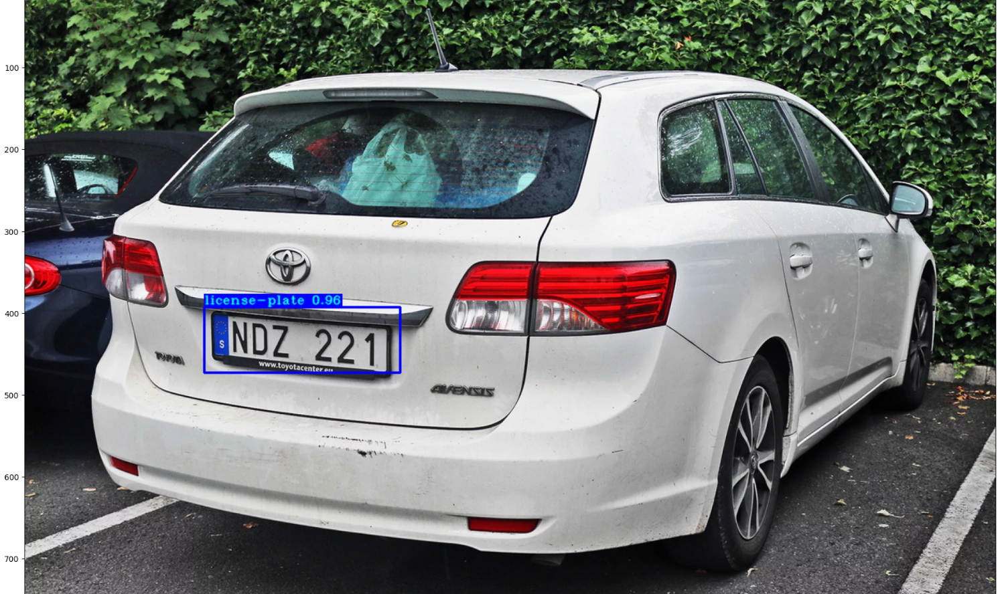

## Установка
Для начала склонируйте репозиторий и установите предтренировочные веса:
```
pip install -r ./requirements.txt
```

# yolov3
wget -P model_data https://pjreddie.com/media/files/yolov3.weights
custom weights: https://drive.google.com/file/d/10Fj94jEgMc8Xc-uimr9F4Egxg-W0d9kp/view?usp=sharing
Кастомные веса надо положить в папку /checkpoints

## В папке /custom_dataset находятся изображения для тренировки модели
Выбран именно такой датасет, так как у него были готовы изображения и размеченные xml файлы меток

## Обработка данных под формат YOLOv3
```
!python tools/XML_to_YOLOv3.py
```

`./yolov3/configs.py` конфиг настроен для тренировки модели.

## Тренировка модели
Тренировать можно через терминал
```
python train.py
tensorboard --logdir=log
```
А также через notebook
```
from train import *
tf.keras.backend.clear_session()
main()
```

## Оценка модели
Tensorboard располагается по адресу http://localhost:6006/
<p align="center">
    </a>
</p>
Выше приведены графики всех потерь, используемых в процессе обучения, наиболее важным является validate_loss/total_val:
<p align="center">
    </a>
</p>
Чем меньше значение validate_loss, тем лучше модель. В нашем случае лучшее значение было равно 0.32

## Использование кастомной модели
Далее натренированная модель используется для определения номерных рамок
```
# Create a new model instance
yolo = Create_Yolo(input_size=YOLO_INPUT_SIZE, CLASSES=TRAIN_CLASSES)
yolo.load_weights("./checkpoints/yolov3_custom") # use keras weights

# Plate detection
image_path   = "./images/3.jpg"
detect_data = detect_image(yolo, image_path, "", input_size=YOLO_INPUT_SIZE, show=False, CLASSES=TRAIN_CLASSES, rectangle_colors=(255,0,0))
image = detect_data["image"]
bboxes = detect_data["bboxes"]
image = cv2.cvtColor(image, cv2.COLOR_BGR2RGB)

plt.figure(figsize=(30,15))
plt.imshow(image)
```

<p align="center">
    </a>
</p>

Для распознавания самих символов используется CNN
```
# Create a new model instance
loaded_model = Sequential()
loaded_model.add(Conv2D(16, (22,22), input_shape=(28, 28, 3), activation='relu', padding='same'))
loaded_model.add(Conv2D(32, (16,16), input_shape=(28, 28, 3), activation='relu', padding='same'))
loaded_model.add(Conv2D(64, (8,8), input_shape=(28, 28, 3), activation='relu', padding='same'))
loaded_model.add(Conv2D(64, (4,4), input_shape=(28, 28, 3), activation='relu', padding='same'))
loaded_model.add(MaxPooling2D(pool_size=(4, 4)))
loaded_model.add(Dropout(0.4))
loaded_model.add(Flatten())
loaded_model.add(Dense(128, activation='relu'))
loaded_model.add(Dense(36, activation='softmax'))

# Restore the weights
loaded_model.load_weights('checkpoints/my_checkpoint')
```

<p align="center">
    </a>
</p>
